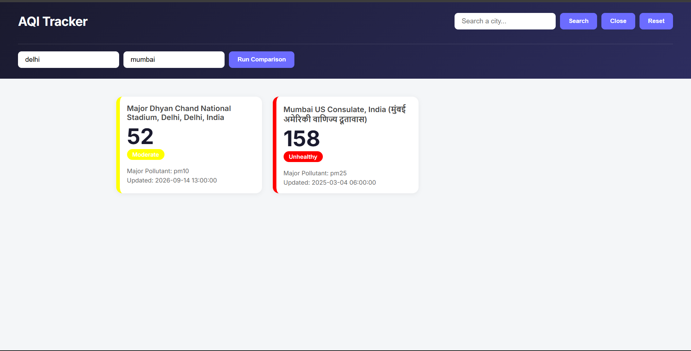

# AQI Tracker

A real-time Air Quality Index dashboard built with vanilla HTML, CSS, and JavaScript — no frameworks, no build tools. Search any city for live AQI data, or compare two cities side by side.

**[Live Demo](https://aqi-tracker-smoky.vercel.app/)**

**[Repo](https://github.com/prateekbuilds/AQI-Tracker)**

 

## Features

- 🔍 **Live city search** — real-time AQI data pulled from the [WAQI](https://aqicn.org/api/) public API
- 🎨 **Severity-based color coding** — cards are color-coded (green → maroon) based on standard AQI bands, so risk is scannable at a glance
- ⚖️ **Multi-city comparison** — compare two cities at once, with independent success/failure handling per city (if one city fails, the other still renders)
- ⏳ **Loading and error states** — clear feedback while data is fetching, and specific error messages when a city isn't found
- 📱 **Responsive layout** — CSS Grid-based card layout that adapts to any screen size

## Tech Stack

- HTML5, CSS3 (Grid/Flexbox), vanilla JavaScript (ES6+)
- [WAQI API](https://aqicn.org/api/) for live air quality data
- Deployed on Vercel

No frameworks were used intentionally — this project focuses on core JS fundamentals: async/await, the Fetch API, DOM manipulation, and state management without a library doing it for you.

## Architecture

The app is split into two clear responsibilities that never overlap:

- **`fetchAQIData(city)`** — purely responsible for getting data. Builds the request URL, calls the WAQI API, validates both the HTTP response and the API's own internal status field, and returns the parsed data (or `undefined` on failure). It has no knowledge of the DOM at all.
- **`renderAQICards(data, city)`** — purely responsible for display. Takes already-fetched data and builds a styled card element from it. It has no knowledge of *how* the data was obtained.

Keeping these separate made the comparison feature straightforward to add later — the same two functions are reused for both single search and multi-city comparison, just called differently.

### Multi-city comparison

The compare feature fetches both cities concurrently using `Promise.allSettled()` rather than `Promise.all()`. This was a deliberate choice: `Promise.all()` rejects entirely if *any* one promise fails, meaning one invalid city would prevent a valid city's data from ever being shown. `Promise.allSettled()` waits for both requests regardless of outcome and reports each one's status independently, so a failed lookup for one city doesn't block a successful result for the other.

## Notable engineering decisions

- **Switched APIs mid-build.** Originally built against OpenAQ's v3 API, but it has no city-name search (coordinates only) and doesn't support direct browser calls (CORS-blocked, key-in-header). Switched to WAQI, which supports direct city-name lookups and browser-safe token-in-URL auth — a better fit for a client-only project.
- **API key is committed in this repo.** Since this is a fully static, client-side project with no backend, there's no way to fully hide a client-side API key regardless of where it's stored — it's always readable in the browser's network requests. Given that, and that the WAQI free-tier token carries no billing risk, the token is included directly rather than adding backend infrastructure solely to obscure it. A production app handling sensitive keys would use a backend proxy instead.

## Running locally

1. Clone the repo
2. Get a free API token from [aqicn.org/data-platform/token](https://aqicn.org/data-platform/token/)
3. Create a `config.js` file in the project root:
   ```js
   const WAQI_TOKEN = "your-token-here";
   ```
4. Open `index.html` with a local server (e.g. VS Code's Live Server extension)

## What I'd add next

- A trend chart (Chart.js) showing AQI over time per city
- Rebuilding this same app in React, to compare state management with and without a framework
- Debounced search-as-you-type instead of a submit button
